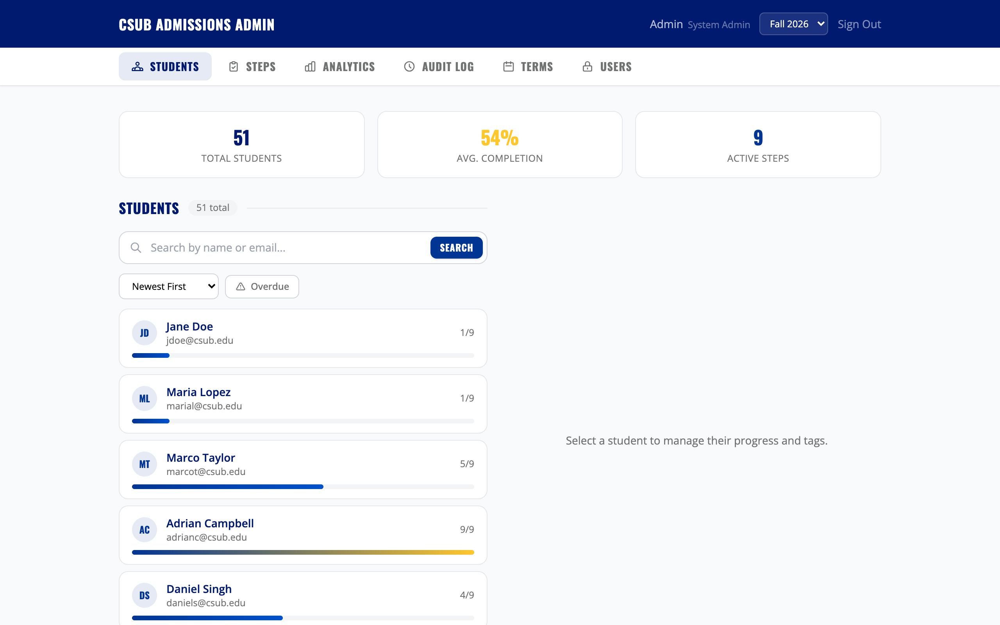

# CSUB Admissions Guide — Road to Becoming a Roadrunner

An interactive student onboarding application for California State University, Bakersfield. Guides newly admitted students through every step of the admissions process — from acceptance to their first day of classes.


---

## Screenshots

### Public Landing Page
The pre-login view shows the admissions checklist and lets prospective students preview the steps ahead.


### Student Dashboard
Once logged in, students see their personalized progress, upcoming deadlines, and next steps.


### Admin Dashboard
Admissions staff manage students, steps, analytics, audit logs, terms, and user roles from a tabbed admin panel.



---

## Features

- **Interactive admissions roadmap** — Step-by-step checklist that tracks student progress from acceptance through enrollment
- **Admin dashboard** — Manage students, steps, analytics, audit logs, academic terms, and admin users
- **Integration API** — REST API for external systems (SIS, ERP, etc.) to sync step completions via stable keys with idempotent batch support
- **Outbound API checks** — Poll external APIs to auto-verify step completion (configurable per step with encrypted credentials)
- **Tag-based step filtering** — Show steps conditionally based on student tags (first-gen, transfer, veteran, honors, athlete, EOP, out-of-state)
- **Optional self-service steps** — Students can mark optional steps as complete or incomplete on their own
- **WYSIWYG rich text editor** — Tiptap-based editor for formatting step instructions with inline links
- **Drag-and-drop reordering** — Reorder admissions steps with a grip handle (Framer Motion)
- **Role-based access control** — Four-tier RBAC: viewer, admissions, admissions_editor, sysadmin
- **Multi-term support** — Manage separate cohorts (Fall 2026, Spring 2027, etc.)
- **Server-side pagination** — Sortable, filterable student lists with overdue deadline detection
- **Audit logging** — Full history of admin and integration actions for accountability
- **CSV export** — Export student progress data for reporting
- **Responsive design** — Works on desktop and mobile
- **Accessibility** — High-contrast mode, keyboard navigation, skip-to-content links, ARIA labels
- **Public preview mode** — Selected steps visible before login for prospective students

---

## Tech Stack

| Layer | Technologies |
|-------|-------------|
| **Frontend** | React 18, TypeScript, Vite 6, Tailwind CSS 3, Framer Motion, Recharts, Tiptap, DOMPurify |
| **Backend** | Node.js 20, Express 4, TypeScript, PostgreSQL 16 |
| **Auth** | JWT sessions, bcrypt password hashing (Azure AD SSO planned — see [Auth Roadmap](docs/AUTH-ROADMAP.md)) |
| **Security** | Helmet, CORS, express-rate-limit, AES-256-GCM credential encryption |
| **Deployment** | Docker containerized single-process server (serves API + static frontend) |

---

## Getting Started

See the **[Development Setup Guide](docs/SETUP.md)** for detailed instructions.

```bash
# Install all dependencies (root, client, and server)
npm run install:all

# Start both dev servers (client on :3000, server on :3001)
npm run dev
```

The client runs at [http://localhost:3000](http://localhost:3000) and proxies API requests to the server at port 3001. The database schema, migrations, and seed data are applied automatically on first start.

### Default Credentials

| Account | Email | Password |
|---------|-------|----------|
| Admin (sysadmin) | `admin@csub.edu` | `admin123` |
| Sample students | Various `@csub.edu` emails | Dev login (name + email) |

> **Warning:** Change the default admin password and JWT secret before deploying to production. See [Auth Roadmap](docs/AUTH-ROADMAP.md) for the production security checklist.

---

## Documentation

| Document | Description |
|----------|-------------|
| **[Development Setup Guide](docs/SETUP.md)** | Prerequisites, installation, environment variables, running locally |
| **[Auth Roadmap](docs/AUTH-ROADMAP.md)** | Current auth state, Azure AD SSO plan, production security checklist |
| **[API Integration Guide](docs/API-GUIDE.md)** | Integration API reference (inbound push + outbound poll) |

---

## Integration API

The app supports two integration patterns for connecting with external systems. See the **[API Integration Guide](docs/API-GUIDE.md)** for full details.

### Inbound — Push Data In

External systems (e.g., PeopleSoft) call our API to update student step completions. Authenticated via integration key (`X-Integration-Key` header or `Bearer` token).

| Method | Endpoint | Description |
|--------|----------|-------------|
| `GET` | `/api/integrations/v1/step-catalog` | Discover available step keys per term |
| `PUT` | `/api/integrations/v1/step-completions` | Update one student's step status |
| `POST` | `/api/integrations/v1/step-completions/batch` | Batch update multiple completions |

### Outbound — Poll External APIs

The app can poll external HTTP endpoints to auto-check whether a student has completed a step. Configurable per step with encrypted credentials.

| Method | Endpoint | Description |
|--------|----------|-------------|
| `PUT` | `/api/admin/steps/:id/api-check` | Configure an outbound check (sysadmin) |
| `POST` | `/api/admin/steps/:id/api-check/test` | Test a check with a sample student (sysadmin) |
| `POST` | `/api/roadmap/run-api-checks` | Student triggers a check run (5-min cooldown) |

---

## How A Student's Step List Works

Each student's roadmap is built from four things:

1. **Assigned term** — the student only sees steps from their current `term_id`
2. **Step visibility rules** — step tags decide whether a student qualifies to see a step
3. **Manual + derived tags** — manual tags are managed by staff, derived tags come from profile fields like applicant type and residency
4. **Progress records** — completion, waiver, or removal changes the student's status on a step

---

## Project Structure

```
CSUB-admissions/
├── client/                     # React SPA (Vite)
│   ├── src/
│   │   ├── auth/               # Auth context
│   │   ├── components/         # Shared UI (Header, StepCard, roadmap/)
│   │   ├── hooks/              # useProgress custom hook
│   │   └── pages/
│   │       ├── RoadmapPage.tsx # Main student view
│   │       └── admin/          # Admin dashboard (5 tabs)
│   ├── tailwind.config.js
│   └── vite.config.js
│
├── server/                     # Express API
│   ├── db/init.ts              # PostgreSQL schema, migrations, seed data
│   ├── middleware/              # auth, adminAuth, integrationAuth, requireRole
│   ├── routes/                 # auth, steps, admin, adminAuth, integrations, apiChecks
│   ├── utils/                  # audit, progress, tags, step keys, encryption, apiCheckRunner
│   └── index.ts                # App entry point
│
├── docs/                       # Documentation
│   ├── API-GUIDE.md            # Integration API guide
│   ├── AUTH-ROADMAP.md         # Authentication roadmap
│   ├── SETUP.md                # Development setup guide
│   └── screenshots/            # App screenshots
│
├── docker-compose.yml          # Docker services
├── Dockerfile                  # Container build
└── package.json                # Root scripts (dev, build, start)
```

---

## Deployment

```bash
# Build for production
npm run build

# Start production server (serves client + API)
npm start
```

In production, the Express server serves the built client from `client/dist/` and handles all API routes. The application runs as a single process — no separate web server is required. Compatible with any container-based hosting platform.

### Docker

```bash
docker-compose up
```

See [SETUP.md](docs/SETUP.md) for environment variable configuration.

---

## License

This project was built for CSUB Admissions. All rights reserved.
